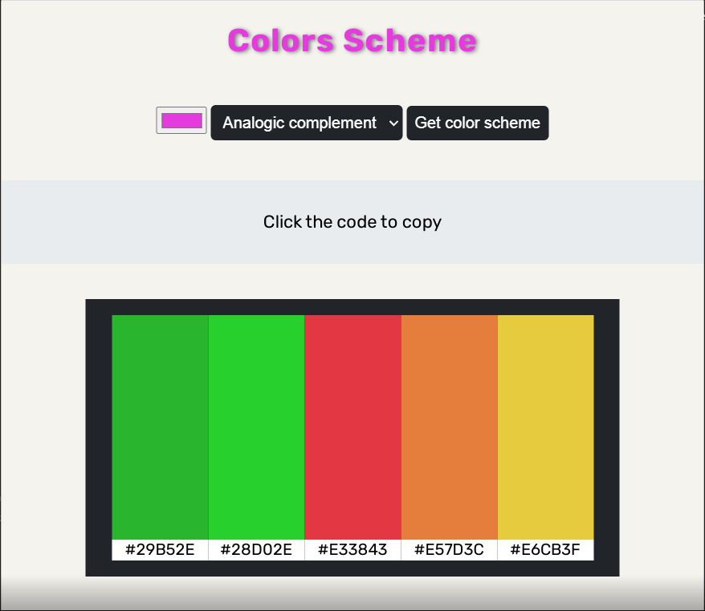

<h2>Purpose</h2>

The aim of this project is to create a form which allows the user to select a color and copy the code.

<h2>Screenshot</h2>

<h2>See it live</h2>
<a href="https://amapola-negra.github.io/Scrimba-Projects-Repo/Frontend-career-path/Color-Scheme-Generator/">Color Scheme Generator</a>
