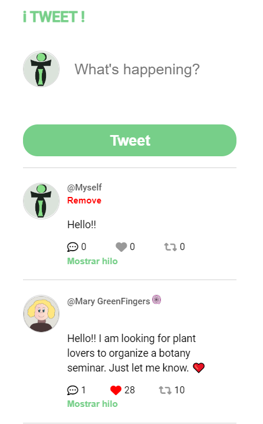

<h2>Purpose</h2>

The aim of this project is to create a clone of Tweeter. It allows to add and remove tweets. It is possible to reply as well

<h2>Screenshot</h2>

<h2>See it live</h2>
<a href="https://amapola-negra.github.io/Scrimba-Projects-Repo/Frontend-career-path/ITweet/">ITweet</a>
