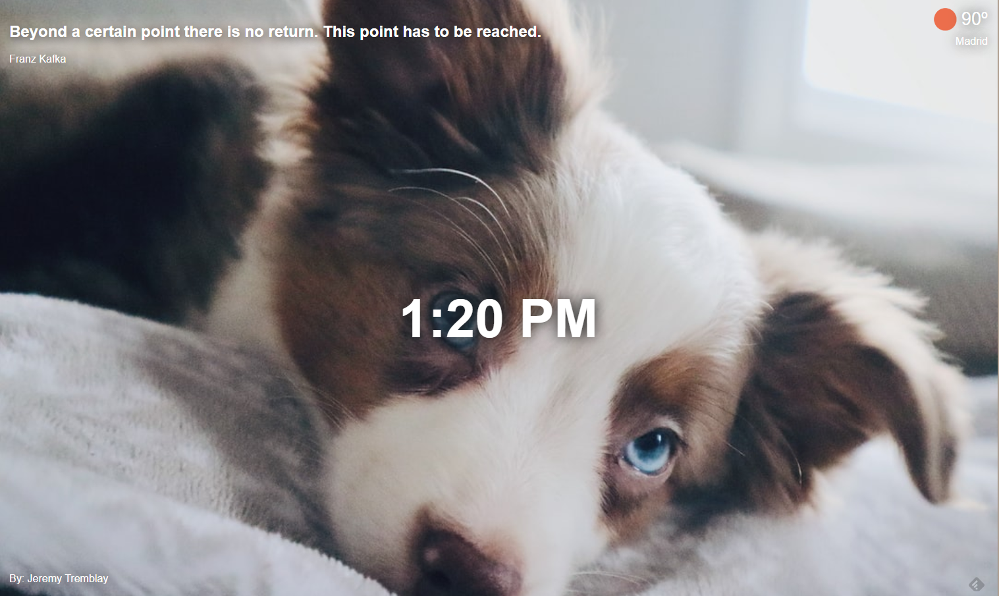

<h2>Purpose</h2>

To develop a Chrome extension which shows the weather, the time and some coins using APIs

<h2>Screenshot</h2>

<h2>See it live</h2>
<a href="https://amapola-negra.github.io/Scrimba-Projects-Repo/Frontend-career-path/Dashboard/">Personal Dashboard</a>
